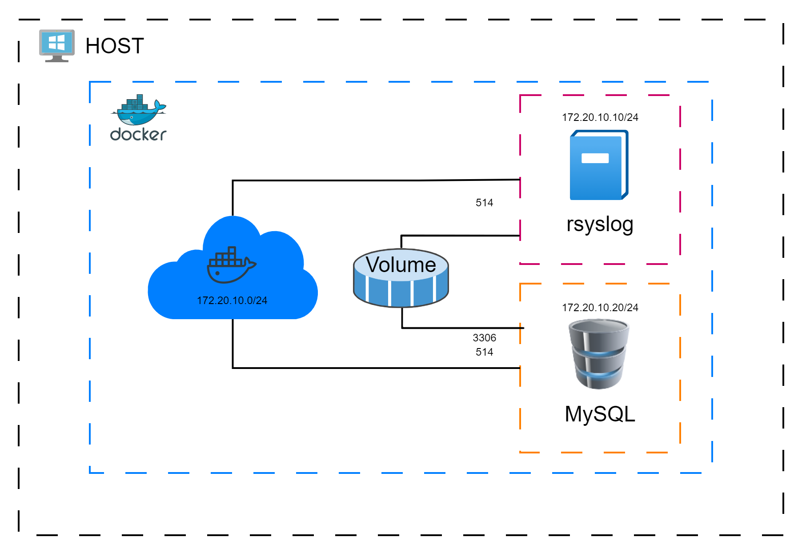

# Docker MySQL-Rsyslog
MySQL and Rsyslog service deployed using Docker

## Description
The scenario consists of two containers, one for a database and the other for keeping records. These are connected by a docker network type bridge and share a volume to gain permanence of both the records and the database.


### Executing program
* Run docker compose file
```
docker-compose up -d
```  
* Take the hole scnenario down
```
docker-compose down
```
### Run MySQL container
Use this command if you want only the MySQL container
```
docker build -t mysql .
docker run -d -p 3306:3306 mysql
```

### Run Rsyslog container 
Use this command if you want only the Rsyslog container
```
docker build -t rsys .
docker run -d -p 514 rsys
```
